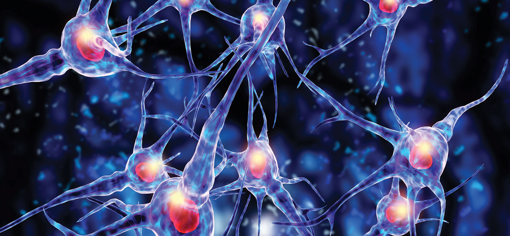

# NanoTorch

## What is NanoTorch?

**NanoTorch** is a deep learning library inspired by the [PyTorch](https://pytorch.org/) framework, created using only **Math** and **Numpy**. It is designed for academic purposes, providing an educational resource for understanding the inner workings of neural networks.

## Why Do We Need NanoTorch?

**NanoTorch** is created for educational purposes, aiming to demystify the complexities of neural networks and their efficient implementation.

### The Purpose of NanoTorch

When learning about deep learning, we often encounter **Neural Networks**—mathematical abstractions of the human brain composed of linear layers and activation functions (non-linearities). These networks learn complex mathematical functions by analyzing large datasets.

To build these networks, we typically use well-designed frameworks like [PyTorch](https://pytorch.org/) from Meta or [TensorFlow](https://www.tensorflow.org/) from Google. However, several questions arise:

1. **How do these neural networks work behind the scenes?**
2. **How do frameworks implement them so efficiently?**

### Understanding the Implementation

While books explain the mathematics behind neural networks, their implementations often fall short of the efficiency and scalability seen in major frameworks. Understanding the source code of frameworks like PyTorch is challenging due to the additional layers of error handling and optimizations.

### The Vision of NanoTorch

**NanoTorch** addresses this gap by providing a library with a PyTorch-like syntax and comprehensive documentation. This documentation not only explains the code but also delves into the mathematical concepts (e.g., gradients, matrices) and the process of transforming these equations into efficient and optimized code.

### When we use NanoTorch

!!! note
    **NanoTorch** is not recommended for real-world projects. It is not as powerful as **PyTorch** or **TensorFlow** and is intended solely for educational purposes.

By understanding how **NanoTorch** works, you will gain familiarity with the implementation principles of frameworks like [PyTorch](https://pytorch.org/), providing a strong foundation for further exploration in the field of deep learning.
